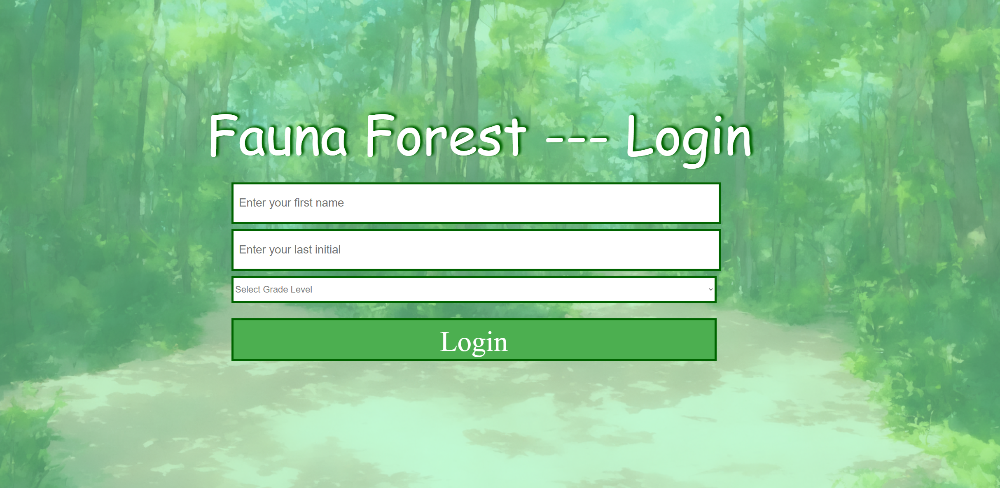
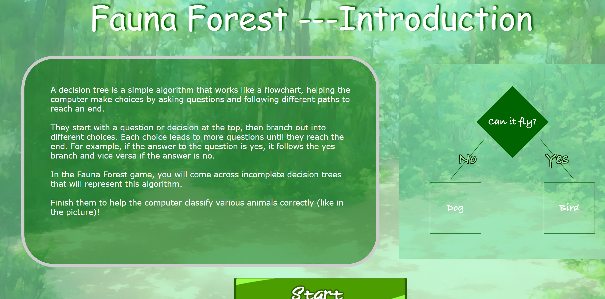
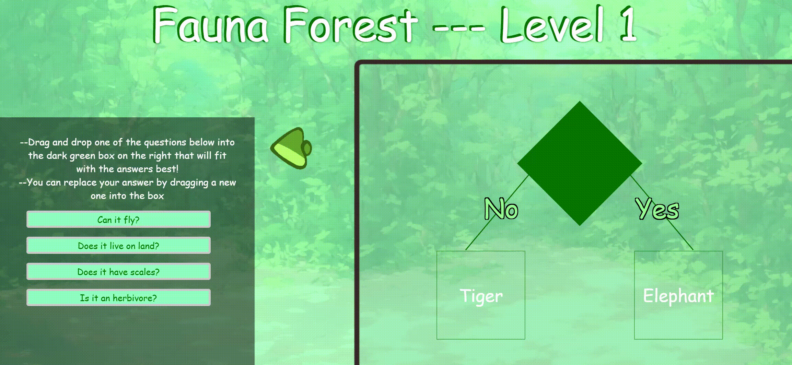

# 🌲 FaunaForest: Decision Tree Learning Demo

FaunaForest is an interactive educational demo designed to help K-12 students understand the basics of **decision trees**, **classification**, and introductory **AI concepts** through a visual puzzle-based game.

Instead of explaining AI only through lectures or formulas, FaunaForest lets students learn by doing. Students complete decision-tree puzzles that classify animals based on simple features, helping them see how computers can make decisions by following a structured sequence of questions.

---

## 📸 Screenshots / Demo Preview

<table>
  <tr>
    <th>Login Screen</th>
    <th>Introduction Screen</th>
  </tr>
  <tr>
    <td></td>
    <td></td>
  </tr>
</table>

### 🎮 Gameplay Screen

<p align="center">
  
</p>

---

## 🎯 Purpose

The goal of FaunaForest is to make artificial intelligence concepts more approachable for younger students.

Many AI systems are built around the idea of using data to make predictions or classifications. FaunaForest introduces this idea through decision trees, one of the most beginner-friendly machine learning models.

Students are shown incomplete decision trees and must choose the correct decision rules to help the computer classify animals correctly.

---

## 🧠 What Students Learn

Through the demo, students are introduced to:

- **Decision Trees**  
  A flowchart-like model that makes decisions by asking questions and following branches.

- **Classification**  
  The process of placing items into categories based on their features.

- **Datasets**  
  Collections of examples that an AI system can use to make decisions.

- **Accuracy**  
  A basic way to measure how well a decision tree performs.

- **AI Reasoning**  
  How an AI system can follow structured logic to reach a prediction or answer.

---

## 🎮 Demo Overview

In FaunaForest, students interact with a forest-themed learning environment where they help classify animals using decision trees.

The demo includes:

1. **Student Login**
   - Students enter their first name, last initial, and grade level.
   - This creates a session for tracking their puzzle progress.

2. **Introduction Page**
   - Students are introduced to the idea of decision trees.
   - The game explains that decision trees work like flowcharts.

3. **Puzzle Levels**
   - Students complete multiple decision-tree puzzle levels.
   - Each level increases in complexity.
   - Students drag and drop decision questions into the correct tree nodes.

4. **Accuracy Testing**
   - Students can test whether their decision tree classifies animals correctly.
   - The demo provides feedback based on the completed tree.

5. **Data Logging**
   - The Flask backend records student information and puzzle performance data.
   - This can be used to review student progress or evaluate how well students understood the activity.

---

## 🖥️ How It Works

FaunaForest is built as a Flask web application.

The backend is handled by `server.py`, which manages page routing, student sessions, and data saving.

The frontend is made up of HTML, CSS, and JavaScript pages for the login screen, introduction screen, and puzzle levels.

### Main Application Flow

```text
Login Page
   ↓
Introduction Page
   ↓
Level 1 Puzzle
   ↓
Level 2 Puzzle
   ↓
Level 3 Puzzle
   ↓
Accuracy / Results Data
